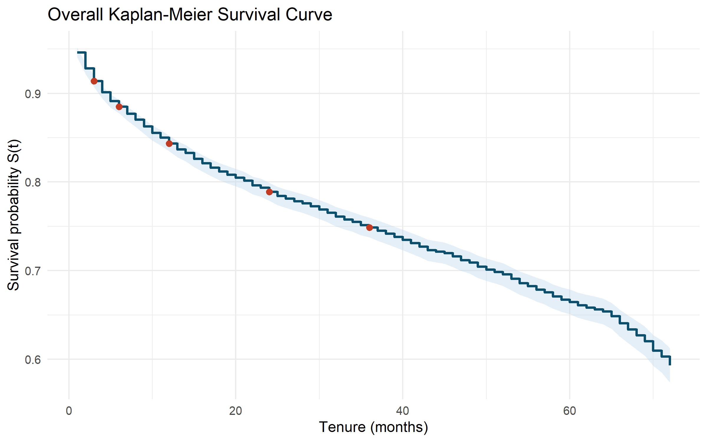
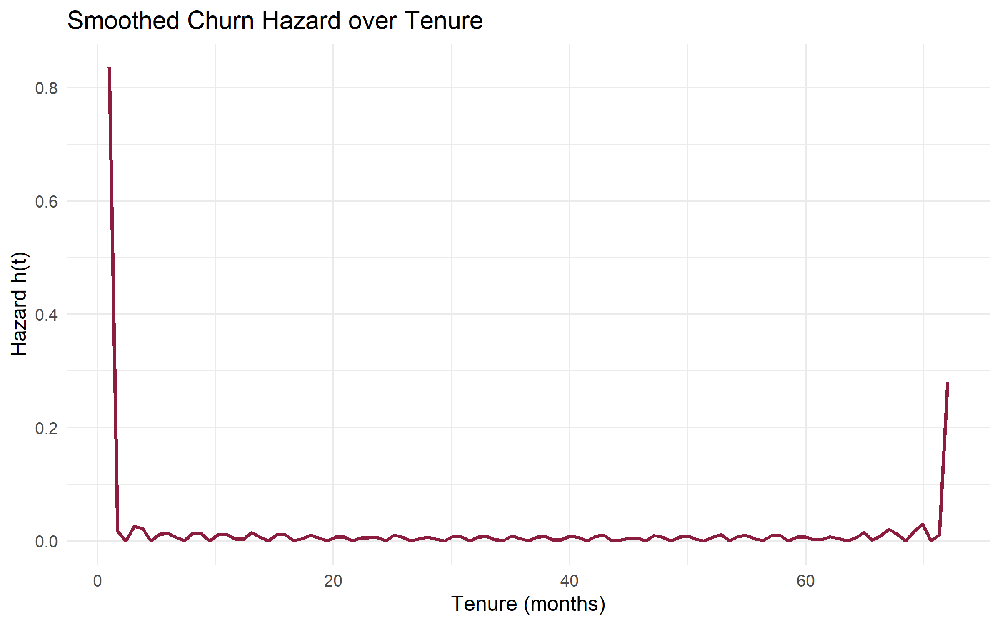

# IBM Telecom Customer Churn using Survival Analysis

Standard churn models treat churn problem as a binary classification task, predicting whether a customer will churn or not. In contrast, survival analysis models the timing of churn, retaining information typically discarded by classification approaches, including:

- the ordering of churn times,
- varying exposure durations across customers, and
- right-censoring for customers who have not yet churned.

By incorporating these elements, survival analysis provides more actionable insights for time-sensitive retention strategies, such as onboarding interventions, early-lifecycle support, and contract renewal planning.

This project applies time-to-event methods to the IBM telecom customer churn dataset, moving beyond a simple churn/no-churn framework to identify both which customers are at higher risk of churn and when that risk is most pronounced over the course of customer tenure.

## Project Overview

The analysis uses:

- `tenure_in_months` as the time-to-event outcome
- `churn_label` as the event indicator
- all remaining columns as customer covariates

The workflow covers:

- data preparation and event coding
- Kaplan-Meier estimation and log-rank testing
- Cox proportional hazards modeling
- parametric survival modeling, including AFT specifications
- model comparison using AIC, BIC, and concordance
- business interpretation of churn timing

## Key Findings

- The dataset contains 7,043 customers, with 1,869 churn events and 5,174 right-censored observations.
- No missing values were reported in the modeling file, and tenure was already strictly positive from 1 to 72 months.
- Churn risk is front-loaded: the smoothed hazard peaks around month 1.0, which points to early-tenure retention as the highest-value intervention window.
- Kaplan-Meier survival at 72 months is 59.3%, and median survival was not reached within the observed follow-up window.
- Contract type is the strongest retention lever. Relative to month-to-month plans:
  - Two-year contracts were strongly protective in the Cox model (`HR = 0.07`).
  - Two-year contracts produced the strongest time extension in the best AFT model (`TR = 5.17`).
- Offer E was the strongest churn accelerator:
  - `HR = 4.60` in the Cox model
  - `TR = 0.28` in the best AFT model
- The Cox model and best parametric comparator both achieved an apparent in-sample C-index of about `0.943`.
- Among parametric models, Gompertz gave the best AIC/BIC trade-off overall, while Generalized Gamma was the best-fitting AFT model by AIC.

## Methods Used

### Exploratory Survival Analysis

- Overall and stratified Kaplan-Meier curves
- Log-rank tests for:
  - contract
  - internet service
  - payment method
- Smoothed hazard estimation over tenure

### Cox Proportional Hazards Model

- Multivariable Cox PH model using the full feature set
- Hazard ratios with 95% confidence intervals and p-values
- Schoenfeld residual testing for proportional hazards diagnostics

### Parametric Models

- Exponential
- Weibull
- Log-normal
- Log-logistic
- Gompertz
- Generalized Gamma

These models were compared using AIC, BIC, and concordance. AFT models were interpreted with time ratios.

## Selected Outputs

### Report

- [Technical report](outputs/telecom_churn_survival_report.md)

### Plots

- [Overall Kaplan-Meier curve](outputs/plots/km_overall.png)
- [Kaplan-Meier by contract](outputs/plots/km_by_contract.png)
- [Kaplan-Meier by internet service](outputs/plots/km_by_internet_service.png)
- [Kaplan-Meier by payment method](outputs/plots/km_by_payment_method.png)
- [Smoothed hazard curve](outputs/plots/smoothed_hazard.png)
- [Cox forest plot](outputs/plots/cox_forest_plot.png)
- [Best AFT forest plot](outputs/plots/best_aft_forest_plot.png)
- [Cox Schoenfeld diagnostics](outputs/plots/cox_schoenfeld_diagnostics.png)

### Tables

- [Cox coefficients](outputs/tables/cox_coefficients.csv)
- [Cox PH test](outputs/tables/cox_ph_test.csv)
- [Parametric model comparison](outputs/tables/parametric_model_fit_summary.csv)
- [Top Cox risk factors](outputs/tables/top_cox_risk_factors.csv)
- [Top Cox protective factors](outputs/tables/top_cox_protective_factors.csv)
- [Top AFT churn accelerators](outputs/tables/top_aft_churn_accelerators.csv)
- [Top AFT retention drivers](outputs/tables/top_aft_retention_drivers.csv)

## Repository Structure

```text
survival_analysis/
|-- data/
|   `-- telecom_churn_model_covariates.csv
|-- outputs/
|   |-- plots/
|   |-- tables/
|   `-- telecom_churn_survival_report.md
|-- r_libs/
|-- scripts/
|   |-- install_missing_r_deps.R
|   `-- run_survival_analysis.R
|-- app.js
|-- index.html
|-- styles.css
|-- vercel.json
`-- README.md
```


## Dashboard

A static dashboard is now included at the repository root via `index.html`, `styles.css`, and `app.js`. It turns the generated analysis outputs in `outputs/` into a presentation-ready interface with:

- KPI cards for sample size, censoring, peak hazard, and model quality
- a lightweight SVG survival chart sourced from `km_horizon_summary.csv`
- ranked churn-risk and retention-factor panels for Cox and AFT outputs
- an image gallery of the generated Kaplan-Meier, hazard, and forest plots
- Vercel-ready static hosting using `vercel.json`

### Run locally

Because the dashboard loads CSV files with `fetch`, serve the repo with a simple static file server instead of opening `index.html` directly from disk.

```bash
python -m http.server 8000
```

Then visit <http://localhost:8000>.

### Deploy to Vercel

1. Push this repository to GitHub, GitLab, or Bitbucket.
2. Import the repo into Vercel.
3. Use the **Other** framework preset.
4. Leave the build command empty; this is a static app.
5. Deploy. Vercel will serve `index.html` at the project root and preserve the `outputs/` assets used by the dashboard.

## How To Run

This project is built around R scripts and includes a workspace-local library folder at `r_libs/`.

### 1. Install or bootstrap missing packages

```powershell
Rscript scripts/install_missing_r_deps.R
```

The bootstrap script targets the required analysis packages and installs them into `r_libs/`.

### 2. Run the full survival analysis

```powershell
Rscript scripts/run_survival_analysis.R
```

This will regenerate the report, tables, and plots under `outputs/`.

## Main Business Implications

- Retention work should be concentrated early in the customer lifecycle because churn intensity is highest near the beginning of tenure.
- Contract design matters heavily. Longer contracts are strongly associated with longer customer survival.
- Offer strategy matters as well: some offers appear protective, while Offer E is associated with much faster churn.
- Payment method, internet service status, satisfaction score, and dependent status all provide useful segmentation signals for targeted retention policy.

## Caveats

- The results are associational, not causal.
- Reported discrimination metrics are apparent in-sample estimates and may be optimistic.
- The Cox PH diagnostics indicate proportional hazards violations for multiple terms, so production use would benefit from time-varying effects, stratification, or more flexible validation work.

## Preview

### Overall Kaplan-Meier Curve



### Smoothed Hazard Over Tenure


